# Data transformation pipeline

In this Pipeline you will deploy a PostgreSQL DB, and connect it to Presto and Superset. You will download a dataset, do some transformation in Python, and then build dashboards out of it. 

## STEP 1: Deploy PostgreSQL
In the left menu  go to *Tools and frameworks* (last tab) and click on *Import Framework*. 

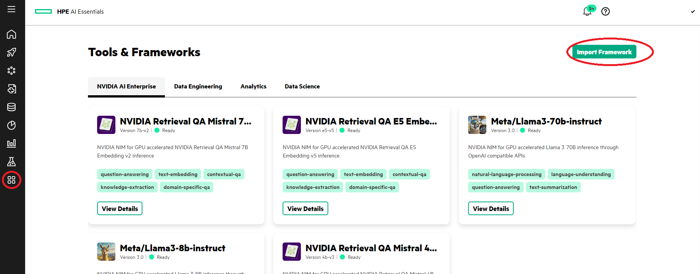

Fill in the information in the wizard.

### Framework details:
- Framework name: `postgresql`
- Version: `1.0.0`
- Description: `postgresql`
- Category: `Data Engineering`
- Icon: Select an icon from your local machine, e.g. `icon.png`

### Framework Chart
- Helm chart: upload the file included in this directory: `postgresql 15.5.34`
- Namespace: the namespace associated with your user (if you are unsure of what this is, go to *Data Science* -> *Kubeflow* and see your namespace on the top) 

### Values:
Don’t change anything here.

Now launch it and wait until it is ready.

## STEP 2: Download the dataset, preprocess it, transform it and upload it 
On *Notebook Servers* click on *New Notebook Server*. Assign it the name `data-notebook` and select *Jupiter lab*. You can use the default container image. 

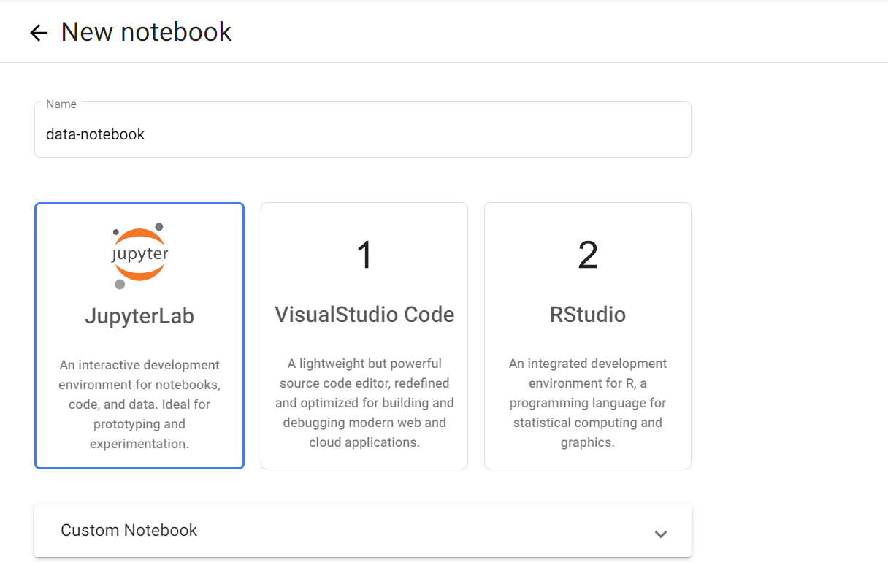

Create a new notebook and Import notebook.ipynb in the environment.

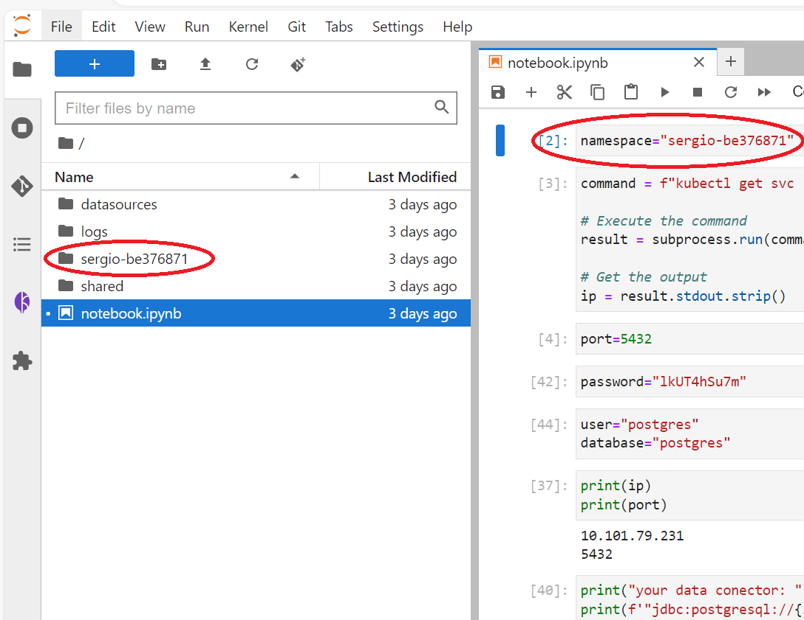

Run all of the commands in the notebook. The notebook will download the housingprice dataset, transform it and preprocess it and upload it to PostgreSQL.
The outcome of the last two cells should be the name of the columns of the dataset and some rows, and the uri, password and username of your data connector.

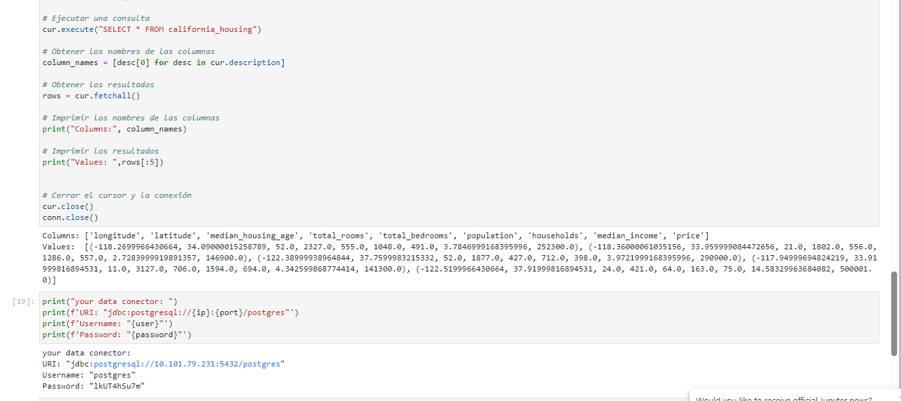

## STEP 3: Import the database in the system (presto)

Go to *Data engineering* -> *Data Sources* tab -> *Add New Data Source*, and search for PostgreSQL. Name it `housingdataset` and use the uri, username, and password that were the outcomes of the notebook as shown below.

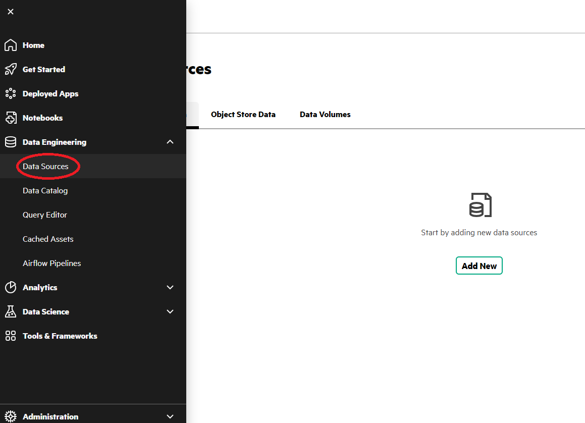

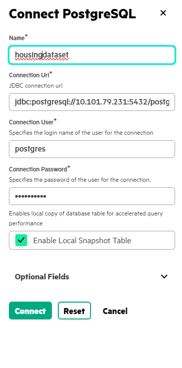

Then select query using data catalog.

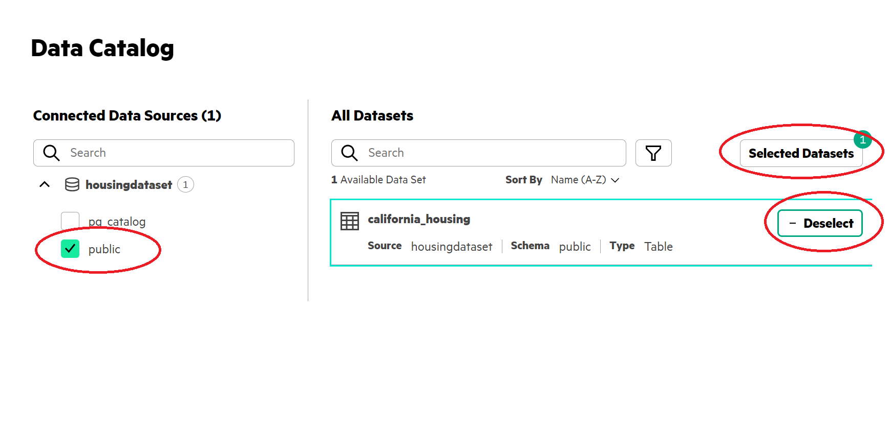

Click on public then select the `california_housing` and on selected datasets. 
Then on *Cache Datasets*, click *Cache Overview* and *Save it to cache*. 

## STEP 4: Connect presto with the superset. 

Go to the tools and frameworks tab, **copy the endpoint of Ezpresto** and open *Superset* in the *Data Engineering* tab. 

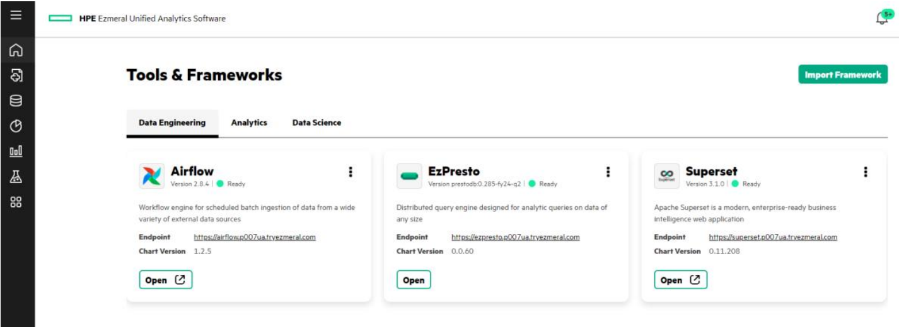

Click on settings and database connections:

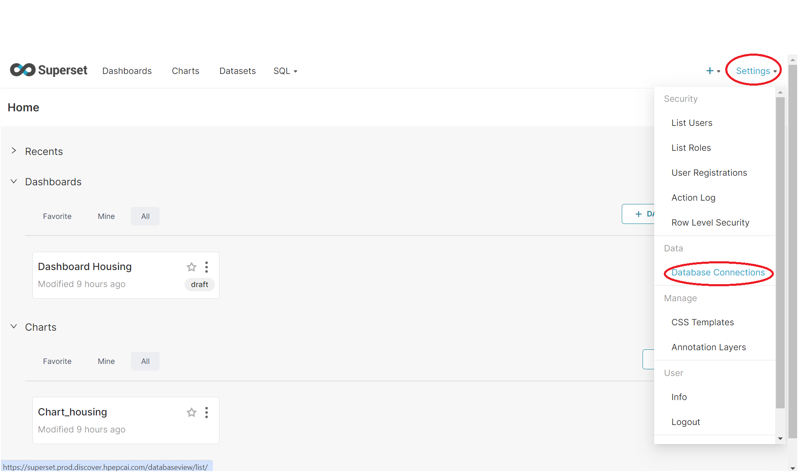

The click on top right "+ DATABASE" button and select *Presto*.

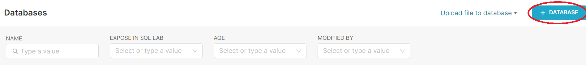

In the *display name*, type `Presto`

For the *SQL Alchemy URI*, use: `presto://{presto_endpoint}:443/cache`

For example, if the endpoint was: https://ezpresto.prod.discover.hpepcai.com
then SQL Alchemy URI would be: `presto://ezpresto.prod.discover.hpepcai.com:443/cache`

## STEP 5: 

Go to the SQL tab and sql lab.
In the left tab select Presto, Default schema and your table schema

Paste this run it, and create a chart from it: 
`SELECT * FROM california_housing`

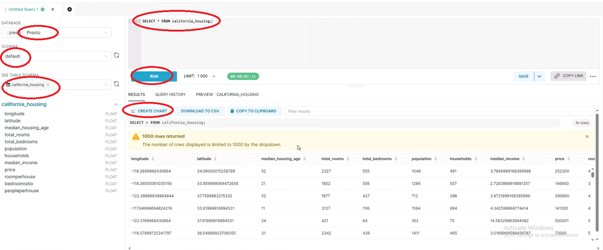

Then create the new chart and save it:

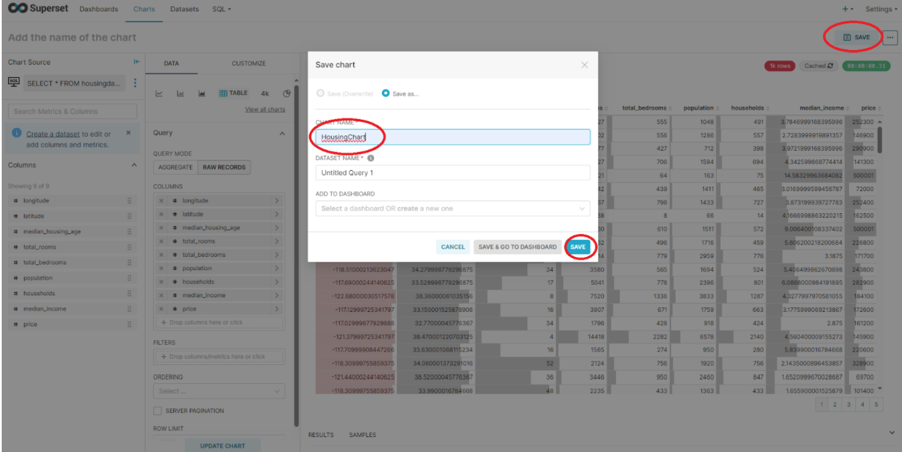

Go to the dashboard part, click on new dashboard, grab your chart and move it to the leftside, and save the dashboard. 

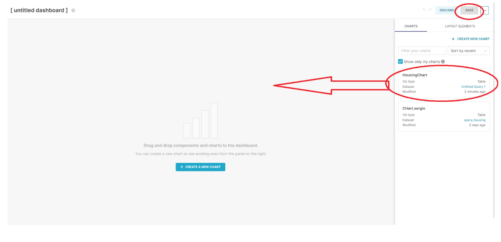

Now you should be seeing a dashboard of the data you have imported and transformed. 
