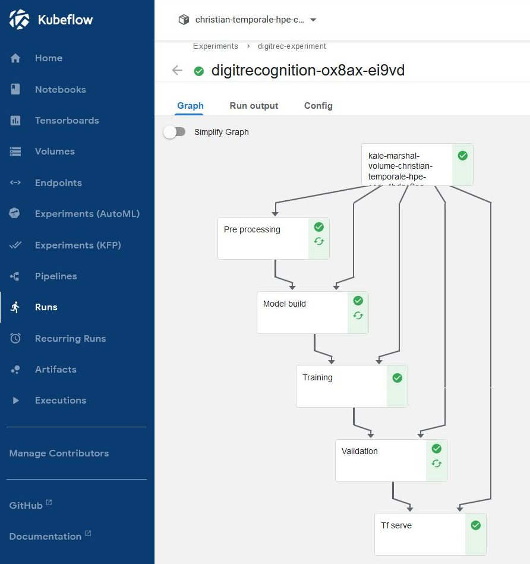
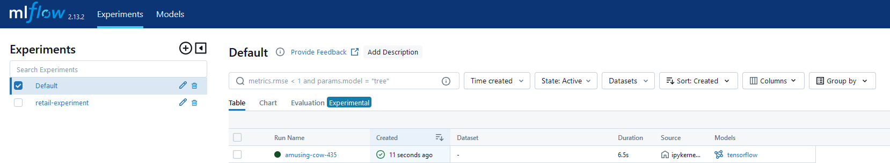
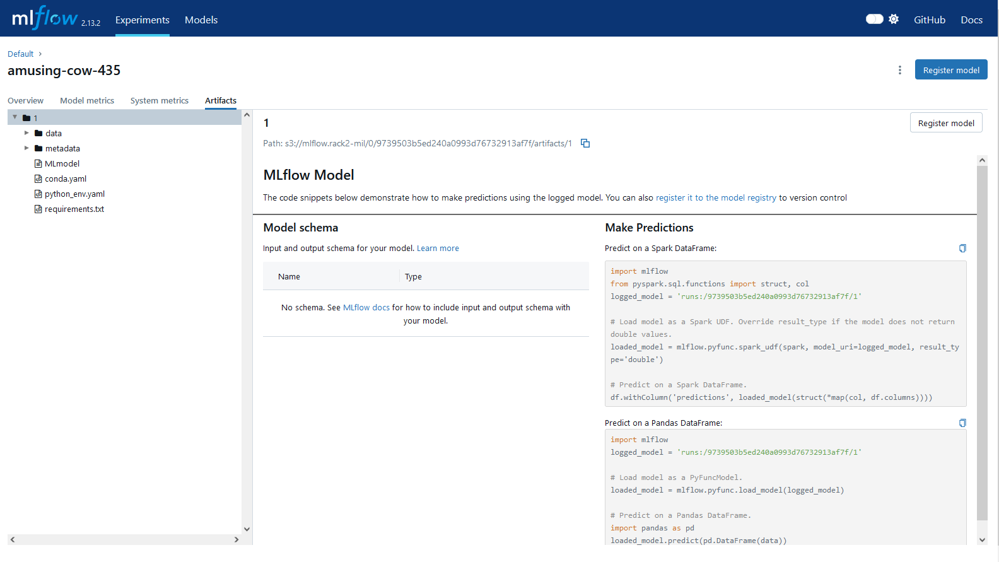
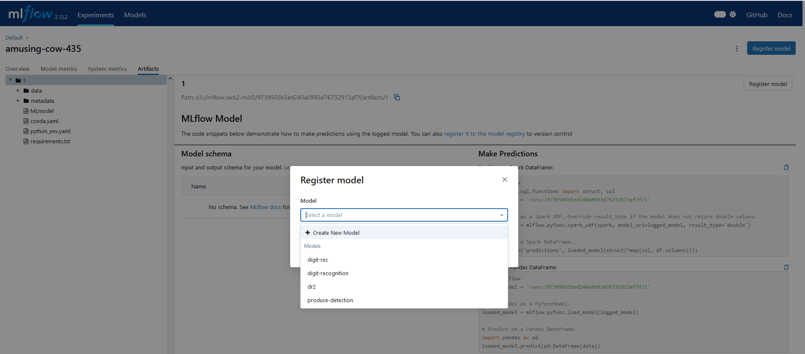

# MLOps Pipeline
This pipeline is split into the following Notebooks:
- **01-Data-acquisition-transformation.ipynb**: Data acquisition and transformation.  
  Main steps:
  - Creation of S3 bucket and population of source data
  - Execution of Spark job, orchestrated by Airflow, copying data from S3 to a shared Kubernetes volume
  - Copy of data to a private volume
  - Transformation of parquet file into pickle (numpy) files, inside the private volume
  - Creation of new volume for future model export
- **02-MLOps-pipeline-kfp.ipynb**: MLOps steps till model deployment.  
  Main steps:
  - Data preparation, starting from pickle files obtained in previos Notebooks
  - Model build
  - Model training with Tensorflow
  - Model validation
  - Model serving with KServe
  - Pipeline execution with KFP
- **02-MLOps-pipeline-HPOptimization.ipynb**: Alternative to 02-MLOps-pipeline that incorporates hyperparemeter optimization  
  Main steps:
  - Data preparation, starting from pickle files obtained in previos Notebooks
  - Model build
  - Model training with Tensorflow
  - Model optimization with MLFlow
  - Model validation
  - Model serving with KServe
  - Pipeline execution with Kale
- **02-MLOps-pipeline-manual.ipynb**: Alternative to 02-MLOps-pipeline that does not use Kale, but a local notebook
  Main steps:
  - Data preparation, starting from pickle files obtained in previos Notebooks
  - Model build
  - Model training with Tensorflow
  - Model optimization with MLFlow
  - Model validation
- **02-MLOps-pipeline-kale.ipynb**: MLOps pipeline using Kale - **Deprecated**: Kale component is no more available since HPE AIE version 1.6.0.
  Main steps:
  - Data preparation, starting from pickle files obtained in previos Notebooks
  - Model build
  - Model training with Tensorflow
  - Model validation
  - Model serving with KServe
  - Pipeline execution with Kale
- **03-Inference.ipynb**: Inference tests.  
  Main steps:
  - HTTP request build
  - Inference tests (Kserve)
- **04-Model-registry.ipynb**: Model registration.  
  Main steps:
  - Model registration in MLflow registry
  - Model retrieval from MLflow
  - Predictions tests

## Prerequisites
A running Jupyter Notebook with the following characteristics:
- Image: `develop/gcr.io/mapr-252711/kubeflow/notebooks/jupyter-tensorflow-full:ezua-1.5.1-d09f82dd`
- CPU/RAM:
  - Minimum CPU: `1`
  - Minimum Memory Gi: `2` 

## Instructions for running the first Notebook (Data acquisition and tranformation)
Manually execute all the steps in the Notebook.
Note: the step "Run Airflow DAG" must be executed manually accessing the Airflow UI. The URL depends on the PCAI environment, and is similar to this:

https://airflow.prod.discover.hpepcai.com/home
- Navigate to 'spark_read_write_parquet mnist' and make sure the toggle on the left is on
- Press the 'play' button
- Click on 'spark_read_write_parquet mnist' and, using the bar chart on the left, ensure that the latest execution is green (for success)

## Instructions for running the second Notebook (MLOps)
Choose one of the `02-MLOps-pipeline-*` notebooks (with or without HPO) to complete the following steps.
These notebooks use KFP (KubeFlow Pipelines).
Open the notebook.

### Configure the base image
Look for the declaration of the base image in the notebook: `BASE_IMG = "10.87.37.60/ezmeral-common/custom-notebook/jupyter-tensforflow-ks-kf:aie-1.6.0"`
Modify the address of the harbor registry with the current one. If you are unsure, go to *Notebook Servers*, click on *New Notebook Server* and check the addresses of the Docker images under *Custom notebook*. 

### Run the notebook
Execute all the cells.

Click the last _Run Details_ link (after _Experiment details_) to directly access Runs section in Kubeflow and see your pipeline running in real time.

After the completion, you will get something similar to this:

## Instructions for running the HPO Notebook using MLflow
There are some manual steps to be followed to register the model in MLFlow, in the section _Manual steps to be performed in MLflow UI_.
Manual steps to be performed in MLflow UI. Here are more details:

1. Access the MLflow UI, and select the _Experiments_ tab.  

2. Identify the latest experiment, and click on _tensorflow_ model. See picture below:  
  

3. On the following screen, click on _Register model_:
  

4. Select _Create New Model_ and type "digit-recognition" (in case this model already exists: just select "digit-recognition" from the list):
  

