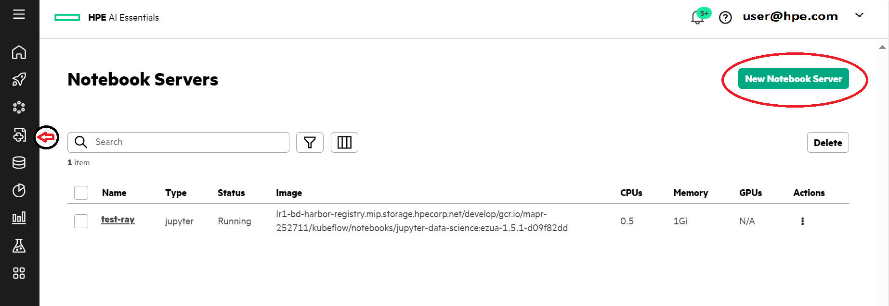
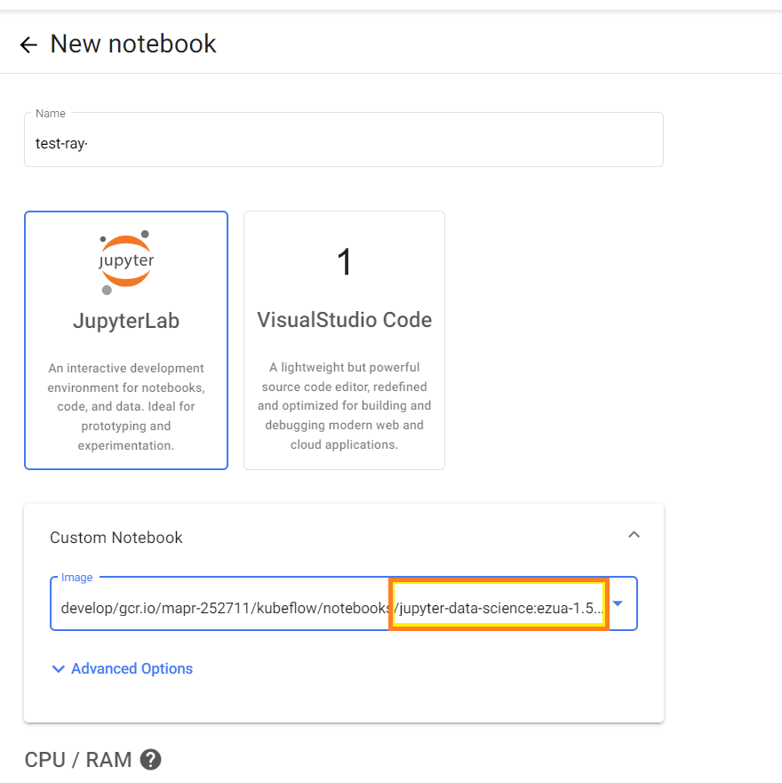
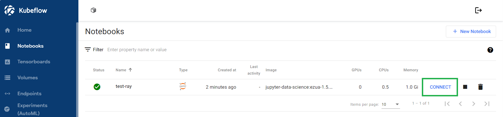
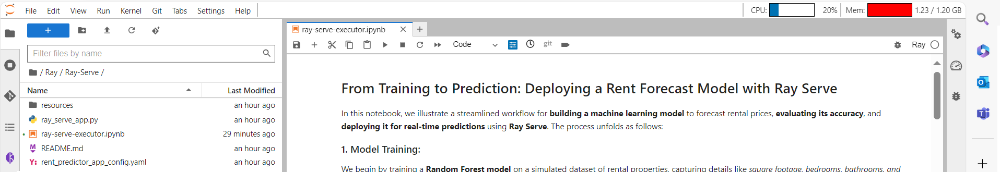
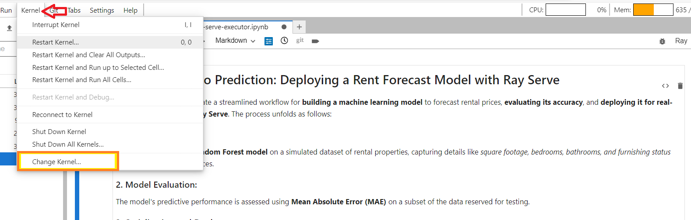
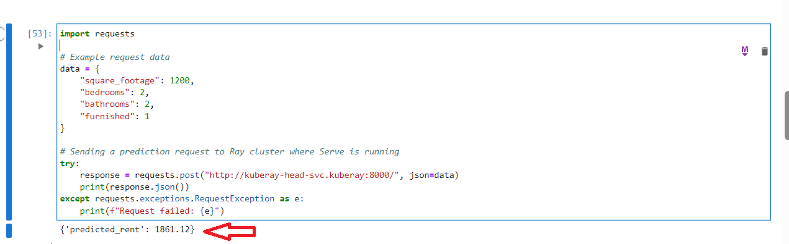
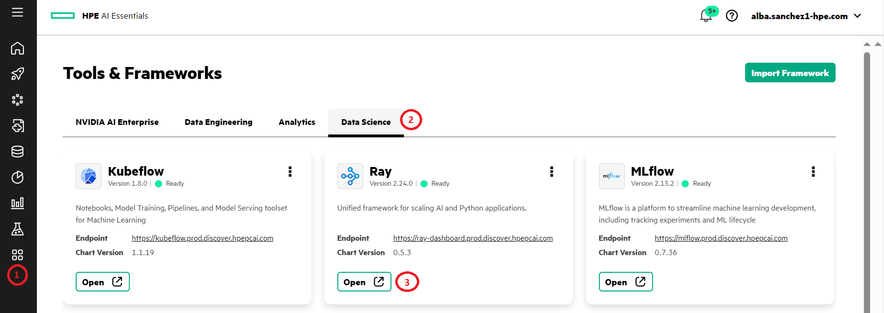
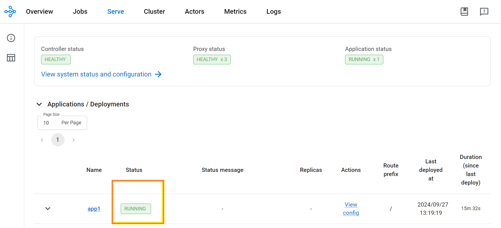
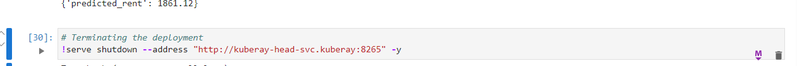

# Rent forecasting
## Step 1 : Creation Notebook file.

1. Go to the *'Notebooks'* tab and click on New Notebook Server:

2.  Create a notebook server using the **jupyter-data-science** image with at least 3 CPUs and 4 Gi of memory in Kubeflow.

2. Wait until the status changes to 'CONNECT'. Once it's connected, click on it again.

## Step 2: Notebook Configuration.

This step is essential for the pipeline to be completed correctly.

1. Import the Ray-Serve folder. 
First, check that the Ray-Serve folder does not exist in your workspace. If it does exist, follow all the steps; if it does not, proceed to the third step.

|Command Instructions |
|----------|
|open terminal and be sure to be in user directory: `cd ~`|
|`cp -r shared/ezua-tutorials/current-release/Data-Science/Ray/ .`|
| |

At this point, you should have the Ray folder, the Ray-Serve folder, and your own notebook inside.

2. Activate the Ray-specific Python kernel.
Go to 'Kernel' and select 'Change Kernel'. Then, choose the Ray option.

## Step 3: Navigate back to the ray-serve-executor.ipynb notebook file.
Follow the instruction inside the notebook for all main steps:
- Build the model
- Dump the model
- Initialize Ray environment
- Deploy the model
- Serve the model   

 
**Important note** - It will take some minutes before the model is deployed. You may want to check the UI (next step) to verify the status of the deployment (all green). If the model has not been entirely deployed, the follwing serving part will fail.
If the deployment is successfull, you test model serving by running the last block of code below: if all works well, you will obtain the prediction result:  
`Predicted rent: 1861.12`

## Step 4: View the deployed application in Ray Dashboard under the Serve tab.

1. Click the Applications & Frameworks icon on the left navigation bar.
2. Navigate to the Data Science tab.
3. Locate and view your deployed application and Wait for the deployed application to be in a Running state.

4. Navigate to the Serve tab.
5. Locate and view your deployed application.
6. Wait for the deployed application to be in a *Running* state.

## Step 5: Terminate deployment. 
After obtaining the prediction results, terminate deployment.

## *References*:  
You can find the complete documentation for this process at the following link:

__https://docs.ezmeral.hpe.com/unified-analytics/14/Tutorials/Tutorials/rent-forecast-model.html__

