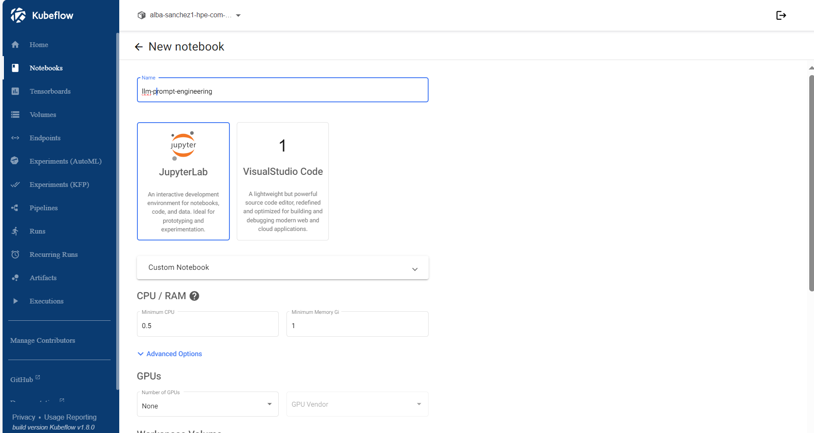
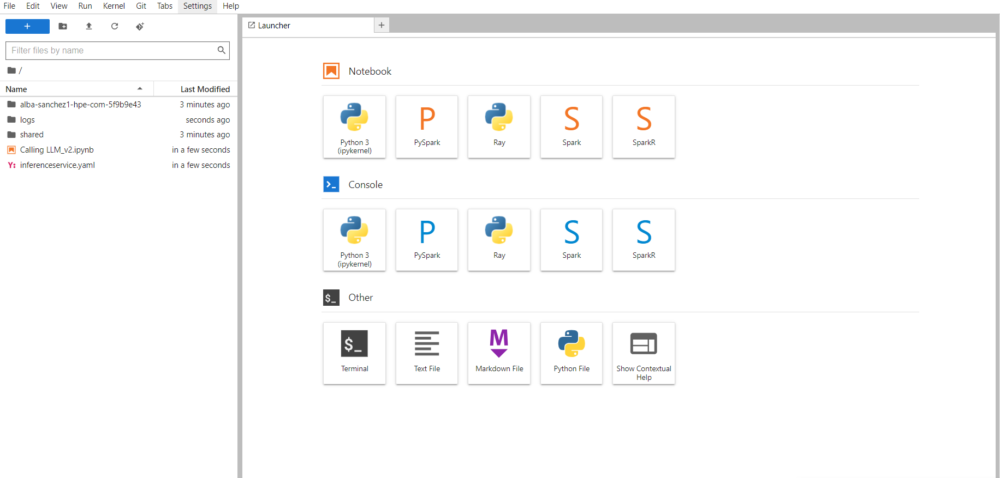
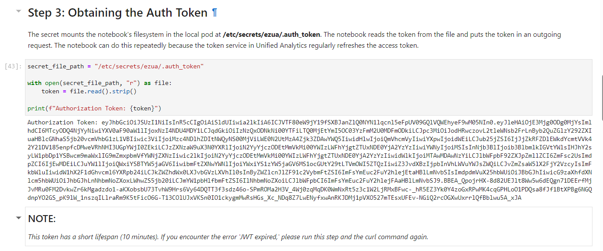
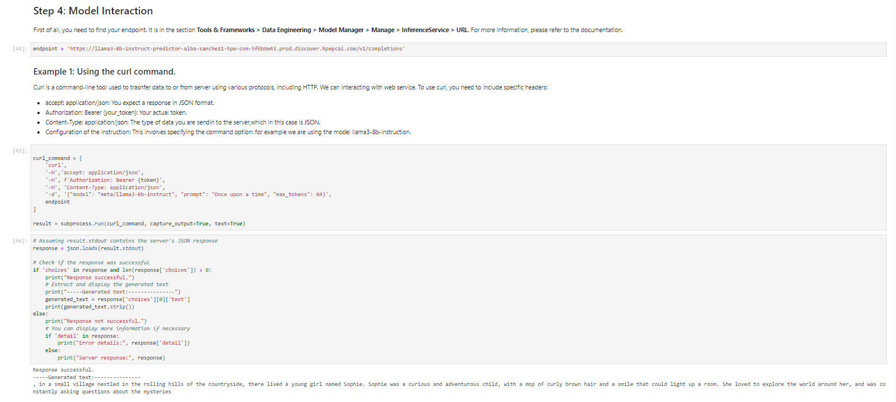
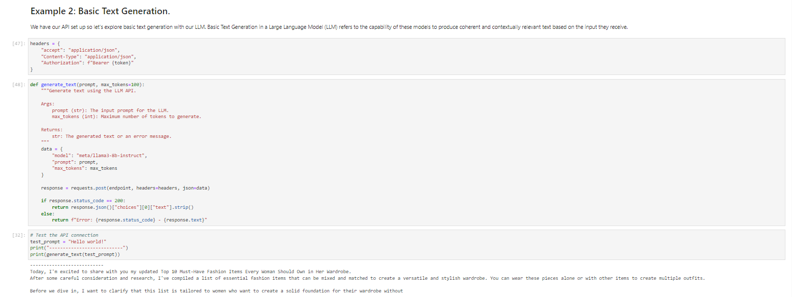
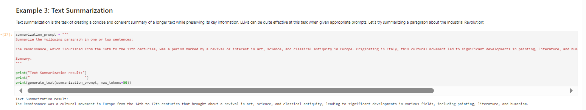
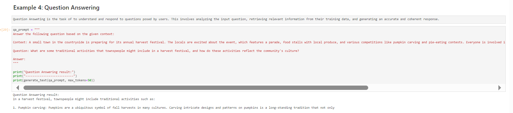
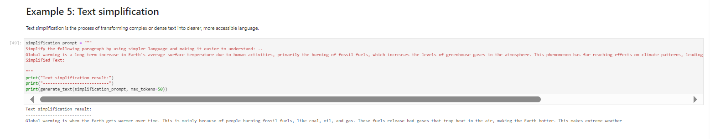

# Deploy an LLM and using it (Step-by-step guide)

We will dive deep into the world of LLMs and demonstrate how to use them effectively. 
We will guide you in the deployment of an LLM on top of PCAI's Ezmeral AI Essential, and expain how to use it from inside a Jupyter notebook. 

## 1. Notebook Deployment
To set up your notebook environment in PCAI, follow these steps: 
1. Navigate to **Notebooks >> New Notebook Server**
2. Complete the configuration settings and click Launch.

3. Return to Notebooks in PCAI and wait until the notebook status changes to Running.
4. Once running, go to **Actions >> 3 dots >> Connect**, and select Launch Server.
After your notebook is set up, upload the following two files; `inferenceservice.yaml` and the notebook `calling_LLM_openai.ipynb`.

## 2. Model Selection or Deployment
For the purpose of this pipeline, the model deployment itself is **not** required, because the latest versions of AIE (1.6.0+) come with some preloaded LLMs, visible under _Tools & Frameworks_ -> _NVIDIA AI Enterprise_ tab.
To retrieve the inference endpoint of a preloaded LLM you want to use, select _Solution Accelerators_ -> _RAG Essentials_ and click on _View Details_.
For each LLM, the embeddings endpoints are shown.

>**Note**: in case you want to deploy your own LLM, you have different ways to do that:
>- #### [Method A: using YAML files](deployment_with_files.md)
>    This is a manual method and requires root access to the system and usage of kubectl commands essential for the deployment of LLM resources..
>- #### [Method B: using a Helm chart](deployment_with_helm.md)
>    This method uses a minimal helm chart containing only the LLM.
>- #### [(Method C: using Model Manager - Currently NOT available)](deployment_with_model_manager.md)
>    This method uses Model Manager, which might be available in the upcoming versions of PCAI. It is described here only for future reference.

## 3. Obtaining the Auth Token
Now, follow the instructions in the notebook, and you will reach your authentication token.

## 4. Model Interaction and examples. 
Configure the LLM embedding endpoint determined in the previous _Model Selection or Deployment_ step.

- Model Interaction

- BasicGeneration

- Text-Summarization

- Question Answerting

- Text-Simplification

# References
https://docs.ezmeral.hpe.com/unified-analytics/15/Security/auth_tokens.html
