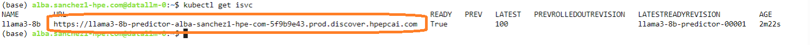

# Deploying an LLMs manually, using kubectl commands
Here we use two kubectl commands to create resources essential to deploy the LLM. All files are into `kubectl-resources` folder.

## 1. Creation of the cluster serving run time
To deploy an LLM, it’s essential to deploy a serving cluster as the **root user**. Use the `clusterservingruntime.yaml` file and run the following command:

 `kubectl apply -f clusterservingruntime.yaml`   
 
This will create a cluster serving runtime using a `llama3-8b-instruct` LLM.

## 2. Creation of the inference server.
From your Jupyter notebook, open your terminal, and click on **Terminal**.   
Run the inference service file using the following command. This file is used to specify the configurations required to deploy our LLM to Kubernetes.

`kubectl apply -f inferenceservice.yaml`

The result should be the follow one: 

## 3. Obtaining the LLM endpoint.
In the same terminal, use the following command to display the public endpoint through which you can currently interact with the LLM:

`kubectl get isvc`

Your endpoint should follow a similar structure to the one highlighted in the orange box in the following image:

