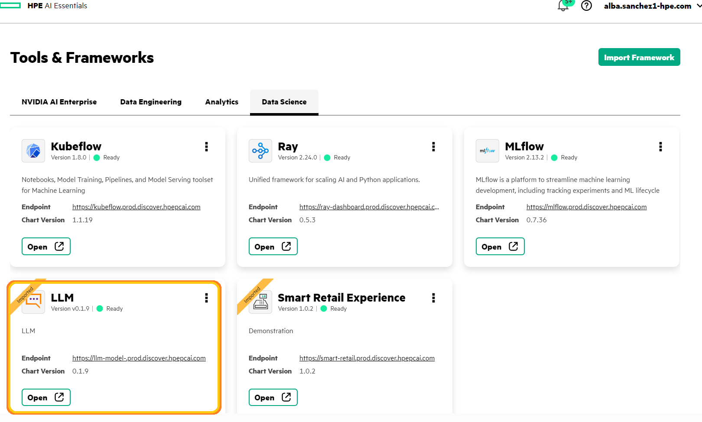

# Deploying an LLMs using a Helm chart

Here we use a simple helm chart containing only the LLM (you can find out this .tgz in `helmchart-llm folder`)

## 1. Creation the Helm Chart.

1. **Deploy the Helm chart in the PCAI environment**
* Navigate to the PCAI environment dashboard and import the Framework in the Data Science tab.

* Fill in the necessary details for the Helm Chart deployment.

* Upload the resulting .tgz file from the previous steps.

* Confirm that the deployment is ready and the LLM is operational.

## 2. Obtaining the LLM endpoint.

To access the LLM endpoint, you can run the following command in your terminal to list all InferenceService resources across your namespace.

**`kubectl get isvc`**

Your endpoint should follow the next schema:

`https://llama3-llm-predictor-predictor-namespace.prod.discover.hpepcai.com ` 

Replace <namespace> with your own namespace. Once you have the full endpoint, you can make API calls to interact with the LLM.

And It should follow a similar structure to the one highlighted in the orange box in the following image:

