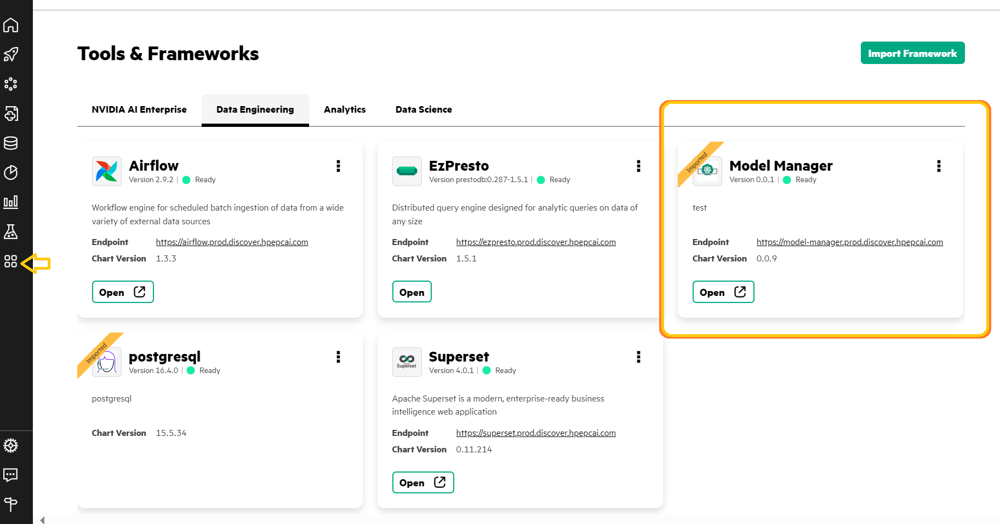
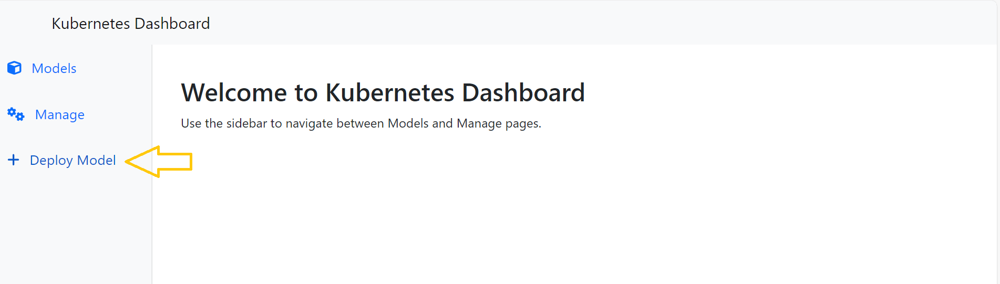
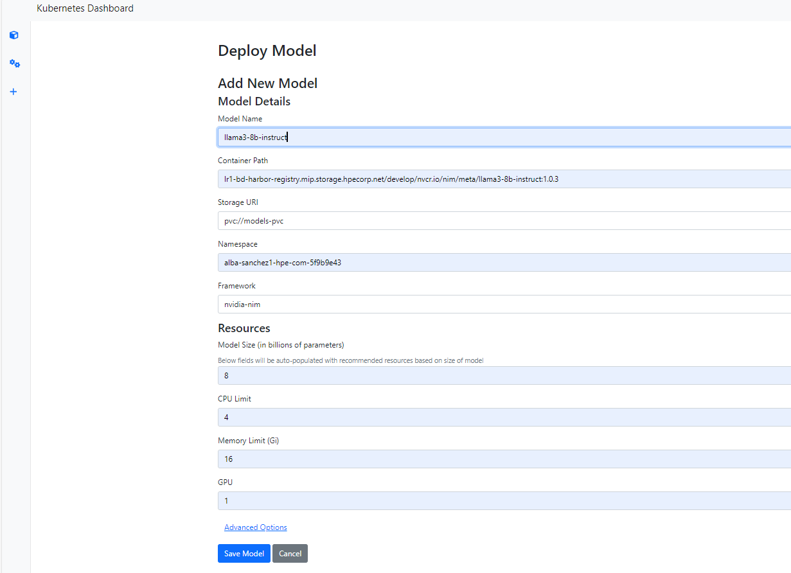
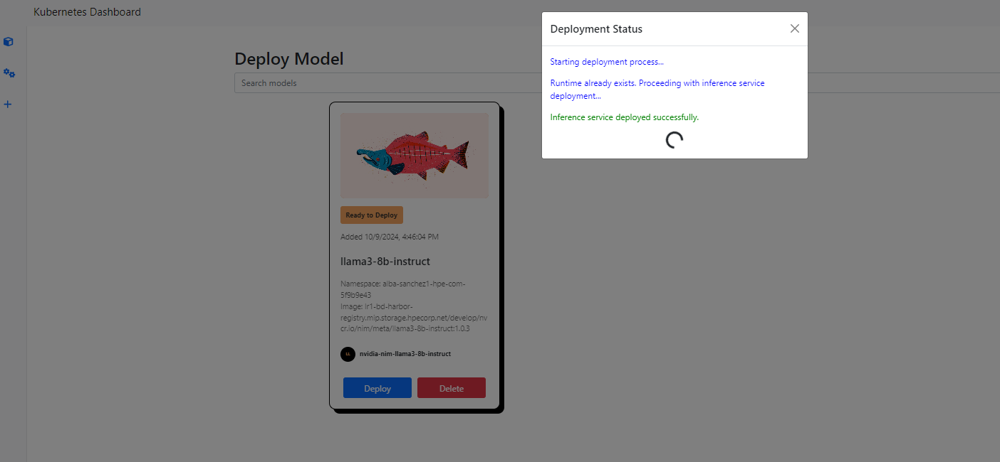
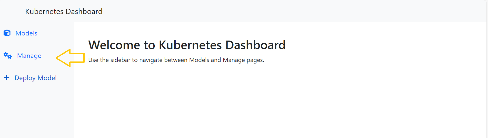
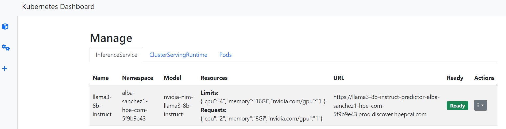
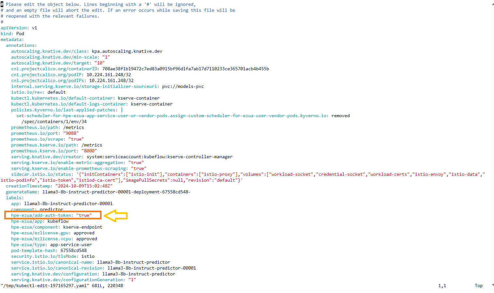
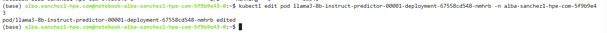

# Deploying an LLMs using Model Manager

Here we use Model Manager to deploy an LLM.

## 1. Configure and deploy the Model

- From Ezmeral AI Essential dashboard, access the Data Engineering tab and open Model Manager.    
  Tools & Frameworks (arrow) > Data Engineering > Model manager. 

- Deploy Model

- Configure the LLM; in this case, we are using `Meta/Llama3-8b-instruct`.

Wait until the model appears and click the Deploy button; this will take a few minutes. The messages should be similar to those in the image. If they are not, it is likely because you entered something incorrectly in the model description.

- Obtain your endpoint 
Go to the Manage tab; you will see your LLM deployed along with the associated endpoint (URL).

Note the endpoint down! You will need it in your notebook.

## 2. Configure Model Pod
To access the endpoint, you need an AUTH_TOKEN. First, you have to add one line in your pod. You can use this command:

`kubectl edit pod llama3-8b-instruct-predictor-00001-deployment-67558cd548-nmhrb -n alba-sanchez1-hpe-com-5f9b9e43` 

- Then, modify the file by pressing a and add this line in the label section:

| |
|---------------|
| hpe-ezua/add-auth-token: "true"  |

Example: 

Click `Esc` then type  `:w` + ENTER and `:q` + ENTER

If everything has gone well, you will receive the following message.

