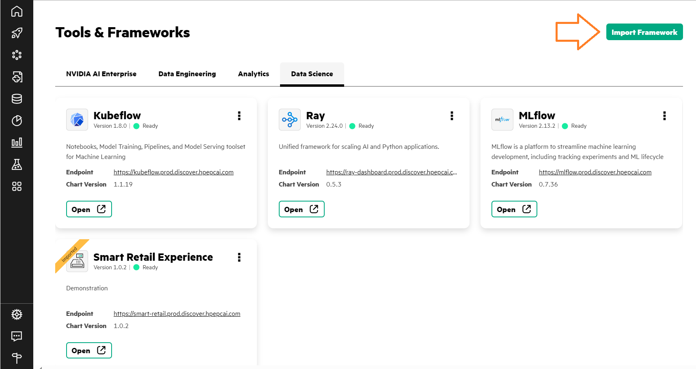
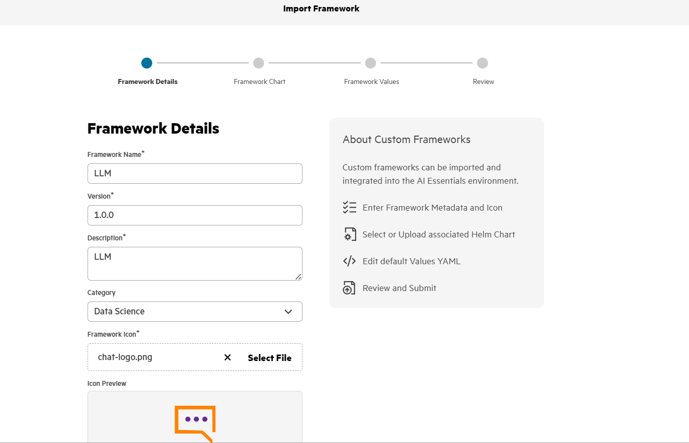
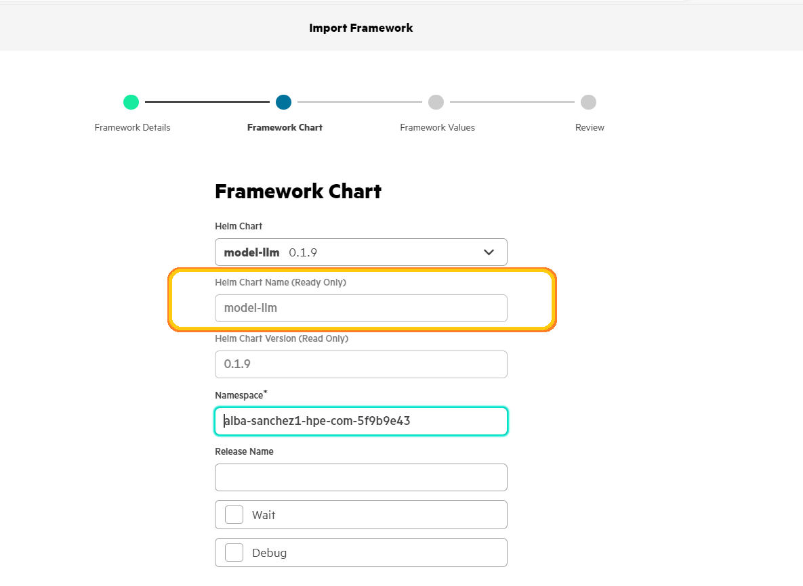
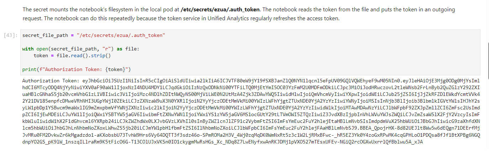
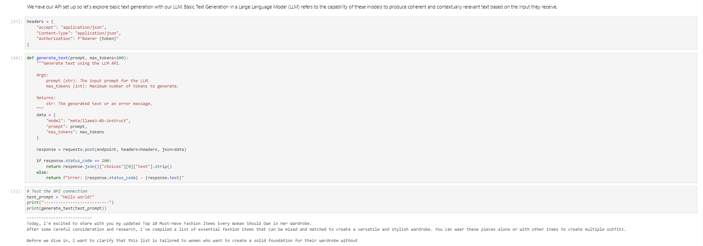
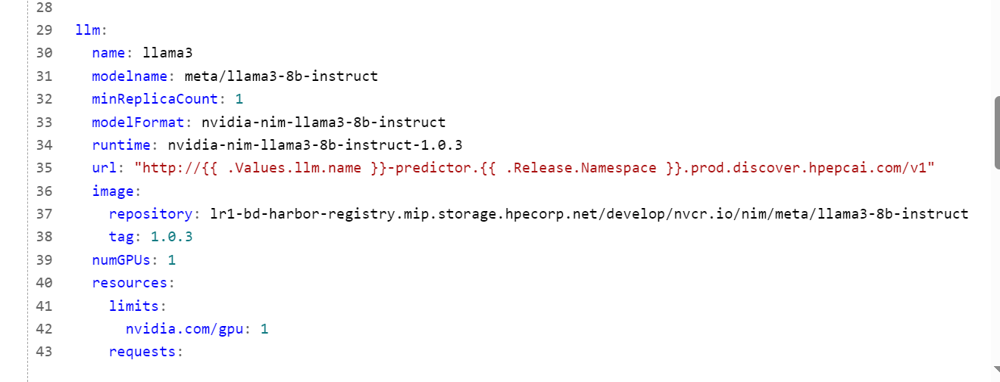

# Deploying a LLM with a Helm Chart. 

The objective of this code is to deploy an LLM with which you will be able to perform several tasks by accessing the model through an endpoint.

## Table of Contents
1. [Introduction](#introduction)
2. [Folder Structure](#folderstructure)
3. [Deployment](#deployment)
4. [Usage](#usage)
5. [Testing](#testing)

## Introduction
This project aims to deploy a Large Language Model (LLM) using a Helm chart. 
The deployment process will enable you to set up the model in a Kubernetes environment, 
allowing you to perform various tasks by accessing the model through an endpoint. 


This guide will walk you through the prerequisites, installation, configuration, deployment, 
and usage of the LLM with a Helm Chart. All of this will be done in PCAI (Private Cloud AI), 
an integrated platform designed to facilitate AI model deployment and management in a secure 
and scalable environment. 

## Folder Structure
The project directory is organized as follows:
```
├── 4_LLM_helm
│   │   ├── templates
│   │   │        ├── helpers.tpl : Template helper functions used in other templeates.
│   │   │        ├── ingress.yaml : Template for the Kubernetes Ingress resource.
│   │   │        ├── llm.yaml : Template for the Kubernetes deployment resource specifit to the LLM.
│   │   │        └── nvidia-nim-llm-1.0.3.yaml : Template for deploying NVIDIA NIM LLM (version 1.0.3)
│   │   │      
│   │   ├── README : Documentation file.
│   │   ├── Chart.yaml : Metadata about the Helm chart.
│   └── └── values.yaml : Default configuration values for the Helm chart.
```

## Deployment
Follow these steps to deploy the LLM using Helm:
1. **Initialize Helm**
Ensure Helm is properly initialized in your Kubernetes cluster. If Helm is not already initialized, 
you can do so with the following command:
   
    `helm init`

2. **Lint the Helm Chart**
This command will validate the Helm Chart and help identify any potential problems. 
   
    `helm lint .`

3. **Package the Helm Chart**
Navigate to the directory containing the Helm Chart and package it. 
This command will create a .tgz file containing the Helm Chart. 

    `helm package .`

## Usage
1. **Deploy the Helm chart in the PCAI environment**
* Navigate to the PCAI environment dashboard and import the Framework in the Data Science tab.




* Fill in the necessary details for the Helm Chart deployment.




* Upload the resulting .tgz file from the previous steps.



* Confirm that the deployment is ready and the LLM is operational.


2. **Access the LLM endpoint**

To access the LLM endpoint, you can run the following command in your terminal to list all InferenceService resources across your namespace.

`k get isvc -A`

Your endpoint should follow the next schema:

`https://llama3-llm-predictor-predictor-namespace.prod.discover.hpepcai.com ` 

Replace <namespace> with your own namespace. Once you have the full endpoint, you can make API calls to interact with the LLM.

3. **Obtaining the Auth Token**

Now, to obtain your authentication token, replicate the following code.



## Testing

1. **Connection to the LLM using a Notebook**
One way to access the LLM is through a notebook. Below is an example of inference



2. **Connection to the LLM using other Helm chart**
Another way is by using a different Helm chart, where you input the endpoint in its configuration as shown in the image:



