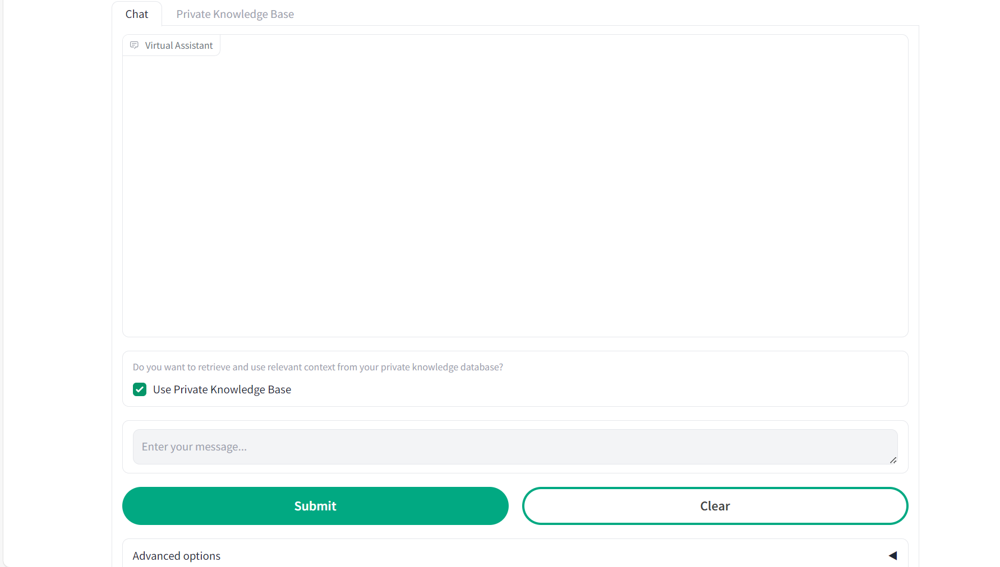
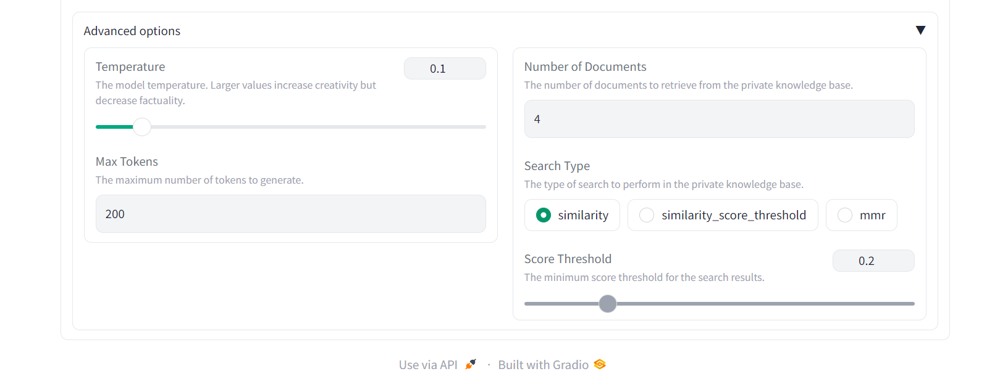
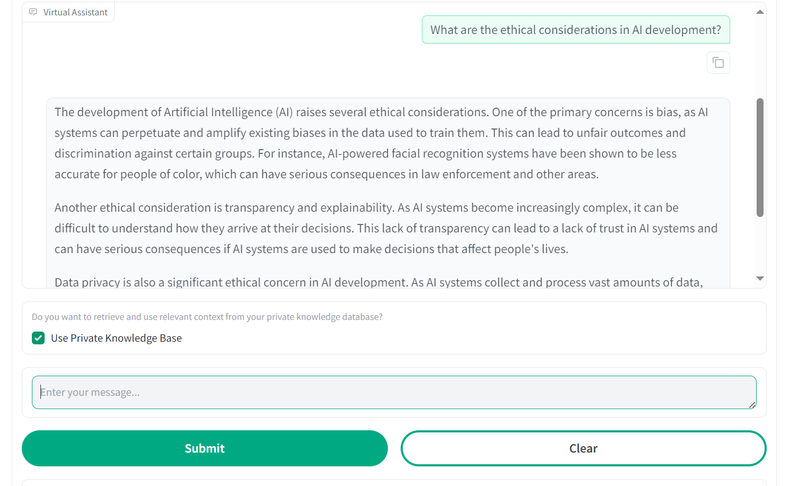

# Generative AI 
This tutorial explains the usage of the Virtual Assistant app and showcases the functionalities of the LLM model and the embedding engine.   
**Important note**: from AIE version 1.6.0, the _Virtual assistant_ accelerator is preloaded in AIE, so the deployment itself is not required. However, in case you need to deploy another version of the Virtual assistant, or deploy a similar app, please refer to the [Deployment guide](deployment.md). 

## Access the 'Virtual-Assistant' Application
From the left menu, click _Tools & Frameworks_ and select _Data Science_.
Select the _Virtual Assistant_ app and click on _Open_ to access it.

## App Functionalities. 
This application deploys an LLM 3B-8b Instructor model and an NVIDIA Retrieval QA Embedding v5 engine to provide advanced language processing capabilities and improve the accuracy of information retrieval

## Chatbot
This is the main interface. To use it, you need to wait a few minutes as the models take time to deploy.

| Tool | Description |
|---------------|---------------|
| *Chat* | The interface where the conversation will appear.|
| *Input Bar* |The area where you can type your questions. | 
| *Clear Button*| A button to clear the conversation history. |
| *Submit Button*| A button to submit your question.|
| *Advanced Options*|Where you can change the quality and accuracy of the response by adjusting various parameters.  |

# Example
Now you can ask anything you need. Below is a sample question and some interesting questions you can ask:
- What is HPE?
- What are the main applications of artificial intelligence in business?

