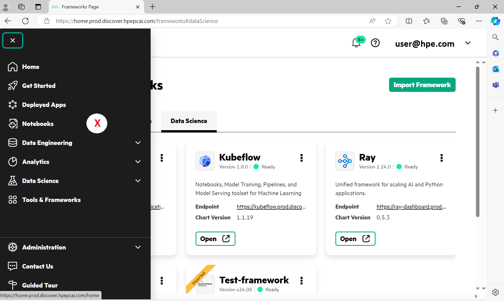
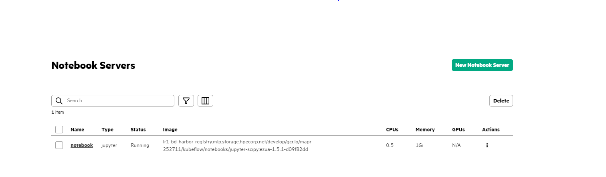
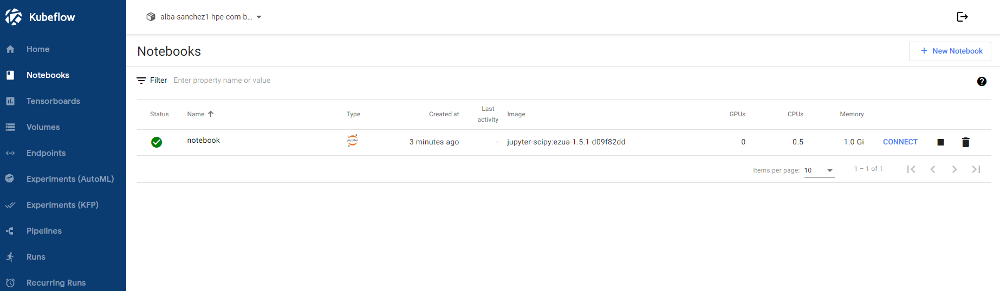
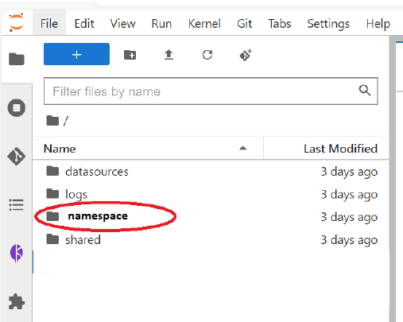
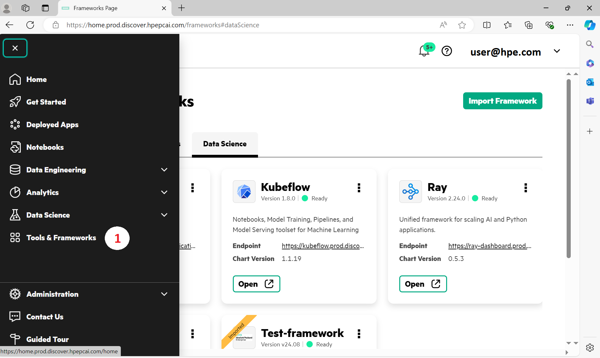
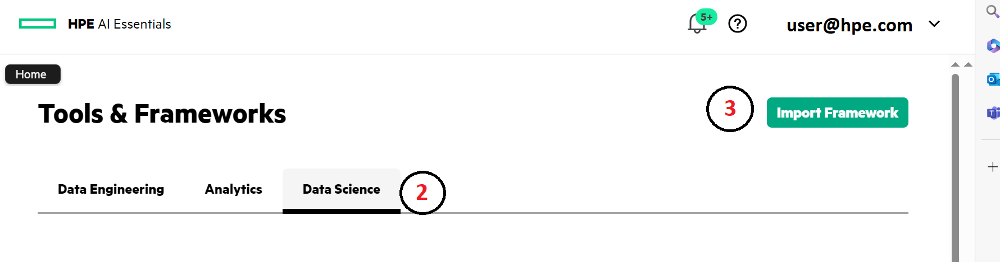
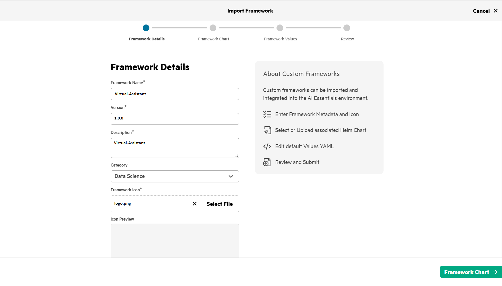
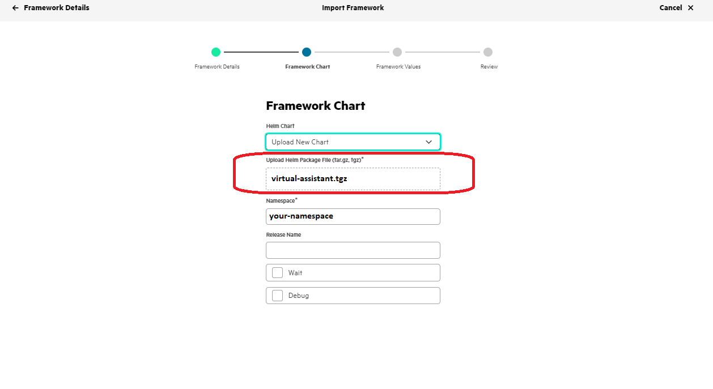
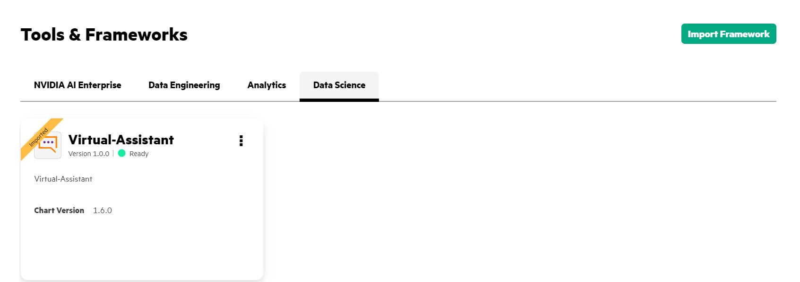

# Deployment of the Virtual Assistant application
This tutorial will guide you in the deployment of a Virtual Assistant application from scratch.

## Previous step: Namespace
It’s important to keep your namespace in mind. If you’re unsure of what it is, follow these steps: 
1. Go to *"Notebooks"* tab and check the default notebook. 

2. Click on it and wait until its status changes to "CONNECT". Once it's connected, click on it again.

3. You will find your namespace here. 

##  Import Framework 
First of all, on the left menu, click _Tools & Frameworks_ and select _Data Science_:

Now, you can create or import your new framework by clicking on _Import Framework_ button:

Now follow each step of the wizard:

### Framework Details
In this tab you need to fill it out exactly as shown in the example:

The framework name is your application name, and the icon is its logo (you can find the logo.png in the `images` folder).

### Framework Chart
Now for the most important part: you need to upload the file `virtual-assistant.tgz` in the _Upload Helm Package File_ section. Then, remember your namespace (see Previous Step) and write it down. No further changes are necessary.

**NOTE:** If, when adding it, you get a message saying that it already exists, look for *'virtual-assistant-0.0.3'* in the HelmChart bar.

### Framework Values
Please, don’t change anything. This tab displays the main values of our framework.

### Review
In this last tab, you will find a brief summary of our new framework.

## Verify access the _Virtual-Assistant_ Application
Return to the Data Science window and wait for the 'Virtual-Assistant' application to appear. Once its status changes to 'Ready', you will be able to use it. 

