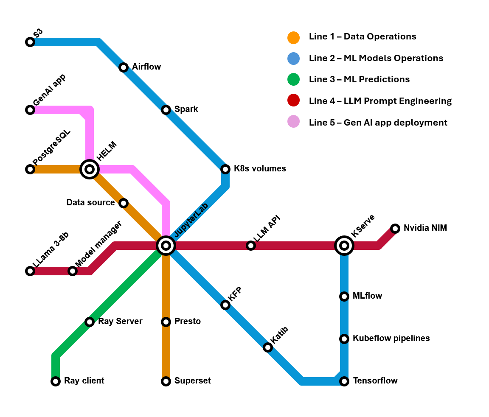
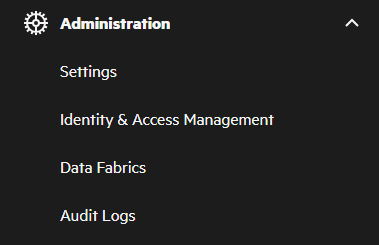

# PCAI-pipelines
This repo contains example pipelines aimed to test PCAI high level SW components.

The goal of these pipelines is to demonstrate that Ezmeral AI Essentials components are working properly.
They are intentionally simple, so that:
- troubleshooting is made easier
- they execute fast
 
The pipelines use the open source SW components provided by AI Essentials as simplied in this "lines map":

 
 

## 1. [Data Operations Pipeline](01-Data-Operations/README.md)
It runs an end-to-end data DataOps workflow.  
Based on: _California Housing Price_ data set and example use case.  
Components used:
- MySQL
- Data source connectors
- Jupyter Notebooks
- EzPresto
- Superset

## 2. [ML Models Operations Pipeline](02-Models-Operations/README.md)
It runs an end-to-end MLOps workflow.  
Based on: _MNIST Digits recognition_ use case example.  
Components used:
- HPE GreenLake for File Storage S3
- K8S volumes
- Airflow
- Spark Operator
- Jupyter Notebooks
- Kubeflow ecosystem, including Kserve and Katib
- MLFLow

## 3. [ML Predictions Pipeline](03-ML-Predictions/README.md)
It runs an end-to-end workflow using Ray.  
Based on: _Rent prediction_ use case example.  
Components used:
- Jupyter Notebooks with Ray Kernel
- Ray

## 4. [LLM Prompt Engineering Pipeline](04-LLM-Prompt-Engineering/README.md)
It runs a Generative AI application.  
Based on: basic prompt engineering examples.  
Components used:
- NVIDIA AI Enterprise
- Bring your own tool (import framework component via Helm chart)
- Jupyter Notebooks
- KServe

## 5. [Generative AI App Deployment Pipeline]( 05-Gen-AI-App-Deployment/README.md)
It deploys and runs a Generative AI application.  
Based on: _Virtual Assistant_ use case example.  
Components used:
- Virtual Assistant application developed by HPE Services
- NVIDIA AI Enterprise
- Bring your own tool (import framework component via Helm chart)

 
 
## Prerequisites
- To run the pipelines you need to have an Administrator role. If you have been granted an admin role, you will see the Administration area in the left navigation bar of EzAIE:  
 

- Some Ezmeral AI Essential components might not be enabled by default, such as fhe following for AIE version 1.6.0:
  - _EzPresto_
  - _Superset_
  - _Livy_
  - _Feast_
 
  Please check from Settings the status of the components, that must be in _Ready_ status. If not, click on the 3 dots, and then _Install_.

- All pipelines run in the form of Jupyter Notebooks, so you need a Jupyter Notebook up & running with the characteristics specified for each pipeline. If not specified, the existing default running notebook will suffice.  
  - In _HPE AI Essentials_ user interface, Notebook servers can be managed from the _Notebooks_ section. 
  - To start a new server, click on _New Notebook Server_.
 
 ## Pipelines deployment
 All the pipelines run on Notebook servers. The notebook server characteristics (CPU, GPU, RAM) are specified in the README of each pipeline, and you are free to reuse a notebook for more than one pipeline, if the resources are sufficient.   
The simplest way to deploy the pipelines is:
 - Do a _Download ZIP_ directly from this github repo and save the zip file in your computer
 - Drag and drop the zip file into your notebook, in the left pane. You can put the file in your home directory.
 - Unzip the file. For example, open a new terminal, and run `unzip PCAI-Pipelines-main.zip`
